Ever used a CRDT, thought you were safe, and—boom—you bought a Ferrari you didn’t mean to? <span style="font-size: 1.5em;">🥔</span><span style="font-size: 3em;">🏎️</span> Yeah, this post is for you.

CRDTs are dangerous to observe: they 
guarantee *eventual consistency*, but you'll never know when "eventual" arrives.
That gap between what CRDTs promise and what you can safely `read` is where bugs sneak in.

What CRDTs *can* offer—*under certain conditions!*—is **monotonicity**:
the guarantee that once you’ve seen a fact, no future update will contradict it. And that’s a powerful tool—if you use it carefully.

> <span class="no-italic">**Estragon.** Let's go.</span><br/>
> <span class="no-italic">**Vladimir.** We can't.</span><br/>
> <span class="no-italic">**Estragon.** Why not?</span><br/>
> <span class="no-italic">**Vladimir.** We're waiting for Godot...</span><br/>
> <span class="no-italic">**Estragon** (looking at the tree). Pity we haven’t got a bit of rope.</span><br/>
> -- Eventual Consistency: The existentialist play you didn't know you were in. 

---
## Takeaways of this Post
<span style="font-size: 1.5em;">☣️</span> **Look not at the naked state of thy CRDT!** Encapsulate it.

<span style="font-size: 1.5em;">⛔️</span> **You will never experience eventuality**. Eventual consistency is an abstract concept, not a guarantee you can count on.

<span style="font-size: 1.5em;">😅</span> **All is not lost!**

- The monotonicity of many CRDTs can help, especially via **threshold functions** that let you test properties of a live CRDT *safely*.
- In general, you'll need coordination to know when you're truly done—use it, sparingly and strategically.

And see the [CRDT Survival Guide](#survival-guide) at the end of the post!

---
## Prologue: "Eventual Consistency"
Have you ever asked that age-old question, "Are we there yet?" Well with eventual consistency, you'll never know.

Eventual consistency promises you’ll eventually get an agreed-upon value... but when is “eventual”? Tomorrow? Next year? After you’ve bought a Ferrari you didn’t mean to? 

Werner Vogels [defined eventual consistency like this](https://dl.acm.org/doi/10.1145/1435417.1435432):  
> *If no new updates are made to the object, eventually all accesses will return the last updated value.*
Sounds reassuring, right? And it avoids expensive coordination protocols like Paxos or Two-Phase Commit. 

But here’s the catch: *How do you know there are no new updates?*
In distributed systems, termination detection (i.e. "am I done yet?") requires knowing:

1. **No node** will issue any new messages.
2. **No messages** are in flight.

In logic, that's:

$$
\neg\exists n  \; (p(n))
$$

"there does not exist an $n$ where property $p(n)$ holds". 

Any time you see a $\neg\exists$ (or its doppelganger, $\forall$) in distributed logic, *beware!* One rogue message — *a single counter-example* — invalidates the property.

👉 **Termination ("eventuality") is non-monotonic**. it can be true over a certain set of information, but become false as more data arrives.

The [CALM Theorem](https://cacm.acm.org/research/keeping-calm/) says that eventual consistency without coordination is possible *if and only if* the program specification is monotonic. Thus (via CALM):

👉 **Termination Detection requires Coordination**. 

So ... in coordination-free systems, you can never know when "eventual" has arrived!

<details>
<summary>Click for a review of monotonicity.</summary>

Given a function $f:S \rightarrow T$, where $S$ and $T$ are ordered domains, we say that $f$ is **monotonic** if:

$$
x \le y \implies f(x) \le f(y)
$$

Intuitively, a monotonic function *preserves order*: it guarantees that if the input gets "bigger", then the output gets no smaller.

Monotonicity is often used in logic, where our domains $S$ and $T$ contain sets of facts. Given an input set $x$, a logical function $f$ produces a set of *conclusions*, $f(x)$. If $f$ is monotonic, $x \subseteq y \implies f(x) \subseteq f(y)$: that is, $f(y)$ contains all the facts in $f(x)$ and perhaps more. 

In practical terms, if we think of $f$ as a process running over a growing stream of facts, we can say this: *once an output fact is concluded by a monotonic function, additional input facts will not invalidate that conclusion*.

You can see why this is useful in a distributed system! 

1. Monotonic functions allow for correct, wait-free, streaming computation.
2. For logical monotonic functions, the truth of a conclusion is invariant in the face of additional input.
</details>


---

## 🙋🏾‍♂️ Is Anything Safe Before "Eventual" comes?

<span style="font-size: 1.5em;">☣️</span> In general, no! The state of a CRDT could be incomplete and may change.

This is a common misunderstanding. it's easy to confuse the formal guarantees of `merge` (which CRDTs provide) with the safety of `read`s (which they absolutely do not). 

If you previously missed this, you are in good company. The danger of `read` is not prominent in online discussion, software packages, or the CRDT literature. Perhaps this post can serve as a warning and a pointer to more subtle discussion in the literature.

Let's illustrate the problem—and ways to use CRDTs responsibly.

---

### 🚨 Two-Phase Sets: Poster Child of the Problem

A 2-Phase (Add/Remove) Set CRDT maintains two sets:

```rust
let adds: Set<(id, element)>;
let removes: Set<(id, element)>;
```

Merges? Safe—just union both sets.

```rust
fn merge(a: &2PSet, b: &2PSet) -> 2PSet {
  2PSet {
    adds: a.adds.union(&b.adds),
    removes: a.removes.union(&b.removes),
  }
}
```

But the `read`?

```rust
fn read(s: &2PSet) -> Set<element> {
  s.adds - s.removes
}
```

This `read` is **non-monotonic**: as `removes` grows, your `read` result *shrinks*. That’s the trap.

#### 🍽️ The Potato/Ferrari Example
Here's an example from our [Keep CALM and CRDT on paper at VLDB](https://www.vldb.org/pvldb/vol16/p856-power.pdf):

> While shopping online at RetailCo, you add a potato and a Ferrari to your cart. Reflecting on your finances, you decide to remove the Ferrari, and check out.<br/>

```rust
cart.add("potato");
cart.add("Ferrari");
cart.remove("Ferrari");
cart.checkout();
```

Unfortunately, some of the CRDT-based cart replicas up at RetailCo receive `checkout` before `remove`. They `read` the cart, and ship you a Ferrari. Boom. <span style="font-size: 1.5em;">🥔</span><span style="font-size: 3em;">🏎️</span>



```mermaid
sequenceDiagram
    participant Client
    participant NodeA
    participant NodeB

    Client->>NodeA: add("potato")
    Client->>NodeB: add("potato")
    Client->>NodeA: add("Ferrari")
    Client->>NodeB: add("Ferrari")
    Client->>NodeA: remove("Ferrari")
    Note right of NodeA: Cart: {potato}
    Client->>NodeB: checkout()
    Note right of NodeB: Cart: {potato, Ferrari} 😬
    NodeB->>Client: 🚗 Ferrari shipped!
```

👉 **Merges are safe; reads are not.** 2P-Sets? Nearly useless for safe reads.

### What about Simpler CRDTs?
Ok fine, 2P-sets use a *set difference* operator, which is clearly non-monotonic. The CALM Theorem warned us that non-monotonic operations require coordination for consistency! 

But surely a plain old grow-only set is safe to read? After all, its `read` function looks nice and monotonic:
```rust
read(s: GrowOnlySet) -> Set {
  s.adds
}
...
let c = GrowOnlySet.new();
```

Looks safe, until you see the downstream logic:

```rust 
let ingredients = c.read();
if edible(&ingredients) {
  cook(&ingredients);
} else {
  panic!("InedibleError");
}
```

I think we can all agree that the emptyset is inedible. But imagine one replica merges some yummy stuff:
```rust
c.merge(['Apple Sauce', 'Walnuts', 'Brown Sugar', 'Butter', 'Flour']);
We transition from `!edible` to `edible`.

Now suppose another replica merges some more stuff:
```rust
c.merge({"broken glass", "bleach", "Paxos"})
```
Adding more stuff transitions us back from `edible` to `!edible`.
Even though `c` grows monotonically, `edible` is not a monotonic function over `c`!

The general point: even monotonic `read`s can lead to non-monotonic conclusions in downstream code.

👉 **Pro Tip:** Use a threshold or explicit coordination when you must ensure correctness.


---
## 🦺 Be Safe, Use Types
CRDT state should be encapsulated, using a language that supports strong typing. If `read` is offered, it should be marked as `unsafe`.

A compiler *might* allow `read` without `unsafe` *if* it can prove all downstream logic is monotonic. But that’s rare. Monotonicity is undecidable in general.

If you’re in Rust, check out [Hydro](https://hydro.run): we’re working on these issues!

---

## 👍 Safe, Practical CRDT Usage: Lower Bounds and Threshold Functions

The discussion above seems pretty negative, but all hope is not lost. Monotonicity to the rescue!

Specificaly, since the value of a CRDT should only go up over time, CRDTs give you trustworthy *lower bounds*. Just don't treat a lower bound as a final answer—it is a different type.

In particular, you can't test for equality with a lower bound, but you *can compose CRDT `read` with additional monotonic logic*.

Let's see how.


### ✅ Thresholds: Coordination-Free Termination

Some lattices are bounded, which means they have a unique top element ($\top$). Once you hit $\top$, you’re done! As a classic example, consider the boolean lattice with values `{false , true}` and merge function that computes $\vee$ (logical `or`).

**Threshold functions** are boolean functions (i.e. truth predicates) on lattices that exploit this:
- They map from a big (or unbounded) lattice to the boolean lattice
- They are *monotone* functions: as the input gets bigger, the output can never go down -- once `true`, always `true`!
- `true` is $\top$ and *safe to `read`*

Clearly `edible` is not a threshold function. What is a good example? Here are two examples on grow-only set lattices: once true, always true!

```rust
state.len() > 100;
state.contains('Apple Sauce');
```

CRDTs and threshold functions can be pretty useful. Even if your full lattice (like a set) has no practical $\top$, your threshold function does! Once you cross that threshold, you can treat the truth value as a stable boolean value—one that will be eventually consistent across nodes. So you can `read` the output of the threshold function safely.

But remember: *until* your threshold function hits $\top$, you’re still in unsafe territory. `Read`s may yet change. So threshold functions are only helpful when they become true!

---

## 🧭 So What Should Systems Do?
Realistically, many eventually consistent systems need to use some coordination at some point. And in many cases that's OK, especially if we can *avoid coordination most of the time*! As my colleague [Natacha Crooks](https://nacrooks.github.io/) said once, "most programs are not monotonic, but most programs are mostly monotonic". So the trick is to put coordination in its place. 

Here's some advice as you think about eventual consistency, CRDTs, monotonic programming, and the like:

**1. Coordination is still needed to *know* when you’re done.**  
Use it sparingly! For example, when you're pretty sure every node is done with a task or session — maybe because some coordination-free threshold has been met — you can employ a round of consensus to detect termination. (Of course if it fails you may have to wait and try again later.)

**2. Don’t trust CRDTs that have non-monotonic `read`s.**  
Non-monotonic `read` methods like that of 2P-sets are *unsafe in any context:* it doesn't matter what you do downstream, the `read` itself exposes you to non-monotonicity and hence race conditions. 2P-sets and their more complicated sibling, OR-sets, are quite troublesome in that respect.

**3. Embrace strong typing and escape hatches.**
CRDT state should be encapsulated, and methods that expose the state should be marked `unsafe`, because
even if the `read` is monotonic, downstream logic may not be. 
There are certainly cases where developers will want to take their non-deterministic chances `read`ing the 
state of a CRDT, and that's their business! But for purposes of maintainability and code review, risky behavior of that sort should be explicitly flagged in code, just like Rust requires us to flag unsafe memory accesses.

**4. Monotonic thresholds are your friend.**  
Thresholds enable safe, observable progress without coordination — *if* you expect to hit $\top$.

In summary, I offer this:
### <a id="survival-guide">CRDT Survival Guide
- ✅ **Safe:** `merge` freely, take advantage of threshold functions.
- ⚠️ **Unsafe:** `read` at your own risk.
- ❌ **Avoid:** Non-monotonic reads like in 2P-sets.
- 🛡️ **Pro Tip:** Treat CRDT state like a radioactive material—encapsulate it, mark `read` as unsafe.

---

## 🧠 Want More?
Check out [Free Termination](https://arxiv.org/abs/2502.00222) for a generalization of threshold-based observation, and stay tuned for the next post on CRDTs’ algebraic properties.
